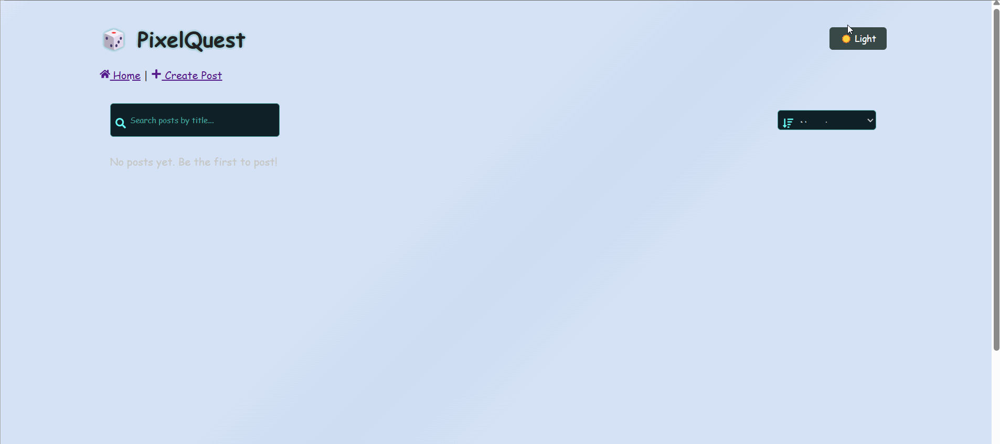

# Web Development Final Project - **PixelQuest** 🎮

Submitted by: **Rahat Moktadir**

This web app: **PixelQuest is an immersive gaming community forum where gamers share epic moments, strategies, achievements, and discussions. Features a sleek cyberpunk-inspired UI with neon effects, animated backgrounds, gaming-themed content categories, enhanced image support, and a vibrant community feel designed specifically for gamers.**

Time spent: **15** hours spent in total

## ✨ Enhanced Gaming Features

### 🎨 **Visual & UI Enhancements**

- **Cyberpunk Gaming Theme**: Neon green (#00ff88) color scheme with animated glowing effects
- **Animated Background**: Floating particles and gradient overlays for immersive experience
- **Gaming Typography**: "Press Start 2P" font throughout for authentic retro-gaming feel
- **Hover Effects**: Cards lift and glow on hover with smooth transitions
- **Responsive Design**: Optimized for mobile and desktop gaming setups

### 🎮 **Gaming-Specific Features**

- **Post Categories**: Question ❓, Opinion 💭, Achievement 🏆, Tips 💡, Review ⭐, Meme 😂
- **Enhanced Image Support**:
  - Real-time image preview with error handling
  - "Random Gaming Image" button for quick testing
  - Validation for image URLs
  - Beautiful image galleries in posts
- **Forum Statistics**: Live stats showing total posts, upvotes, and daily activity
- **Scroll-to-Top Rocket**: Animated rocket button for easy navigation
- **Gaming Emojis**: Throughout the interface for enhanced user experience

### 🚀 **Technical Improvements**

- **Improved Navigation**: React Router integration with no page reloads
- **Better Image Handling**: URL validation and fallback mechanisms
- **Enhanced PostCard**: Shows images, categories, and improved voting UI
- **Mobile Optimization**: Responsive design for gaming on-the-go
- **Performance**: Optimized animations and smooth scrolling

## Required Features

The following **required** functionality is completed:

- [x] **Web app includes a create form that allows the user to create posts**
  - Form requires users to add a post title
  - Forms should have the _option_ for users to add:
    - additional textual content
    - an image added as an external image URL
- [x] **Web app includes a home feed displaying previously created posts**
  - Web app must include home feed displaying previously created posts
  - By default, each post on the posts feed should show only the post's:
    - creation time
    - title
    - upvotes count
  - Clicking on a post should direct the user to a new page for the selected post
- [x] **Users can view posts in different ways**
  - Users can sort posts by either:
    - creation time
    - upvotes count
  - Users can search for posts by title
- [x] **Users can interact with each post in different ways**

  - The app includes a separate post page for each created post when clicked, where any additional information is shown, including:
    - content
    - image
    - comments
  - Users can leave comments underneath a post on the post page
  - Each post includes an upvote button on the post page.
    - Each click increases the post's upvotes count by one
    - Users can upvote any post any number of times

- [x] **A post that a user previously created can be edited or deleted from its post pages**
  - After a user creates a new post, they can go back and edit the post
  - A previously created post can be deleted from its post page

The following **optional** features are implemented:

- [x] Web app implements pseudo-authentication
  - Users can only edit and delete posts or delete comments by entering the secret key, which is set by the user during post creation
  - **or** upon launching the web app, the user is assigned a random user ID. It will be associated with all posts and comments that they make and displayed on them
  - For both options, only the original user author of a post can update or delete it
- [x] Users can repost a previous post by referencing its post ID. On the post page of the new post
  - Users can repost a previous post by referencing its post ID
  - On the post page of the new post, the referenced post is displayed and linked, creating a thread
- [x] Users can customize the interface
  - e.g., selecting the color scheme or showing the content and image of each post on the home feed
- [x] Users can add more characterics to their posts
  - Users can share and view web videos
  - Users can set flags such as "Question" or "Opinion" while creating a post
  - Users can filter posts by flags on the home feed
  - Users can upload images directly from their local machine as an image file
- [x] Web app displays a loading animation whenever data is being fetched

The following **additional** features are implemented:

- [x] Realtime state updates for upvotes and comments (no page reload needed)
- [x] Responsive layout for desktop and mobile
- [x] Flag system for post moderation (e.g. inappropriate content)

## Video Walkthrough

Here's a walkthrough of implemented user stories:

GIF created with ...  
[LiceCap](https://www.cockos.com/licecap/)

## Notes

- Handling asynchronous state updates (e.g., comment submission, upvotes) without triggering reloads was a key challenge.

- Debugging post ownership logic for edit/delete required careful tracking of user IDs.

- Styling responsiveness using plain CSS required manual media queries and layout adjustments.

## License

    Copyright [2025] [Rahat Moktadir]

    Licensed under the Apache License, Version 2.0 (the "License");
    you may not use this file except in compliance with the License.
    You may obtain a copy of the License at

        http://www.apache.org/licenses/LICENSE-2.0

    Unless required by applicable law or agreed to in writing, software
    distributed under the License is distributed on an "AS IS" BASIS,
    WITHOUT WARRANTIES OR CONDITIONS OF ANY KIND, either express or implied.
    See the License for the specific language governing permissions and
    limitations under the License.
